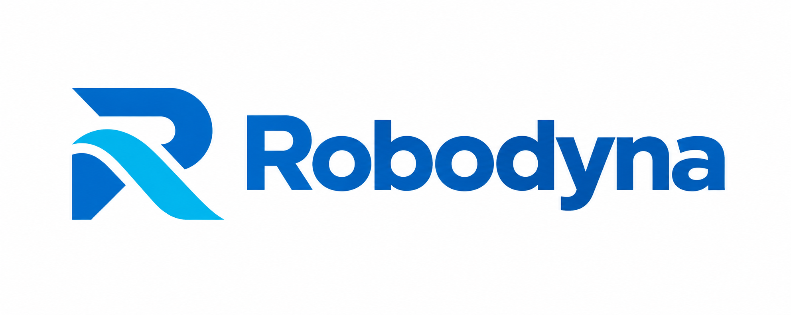
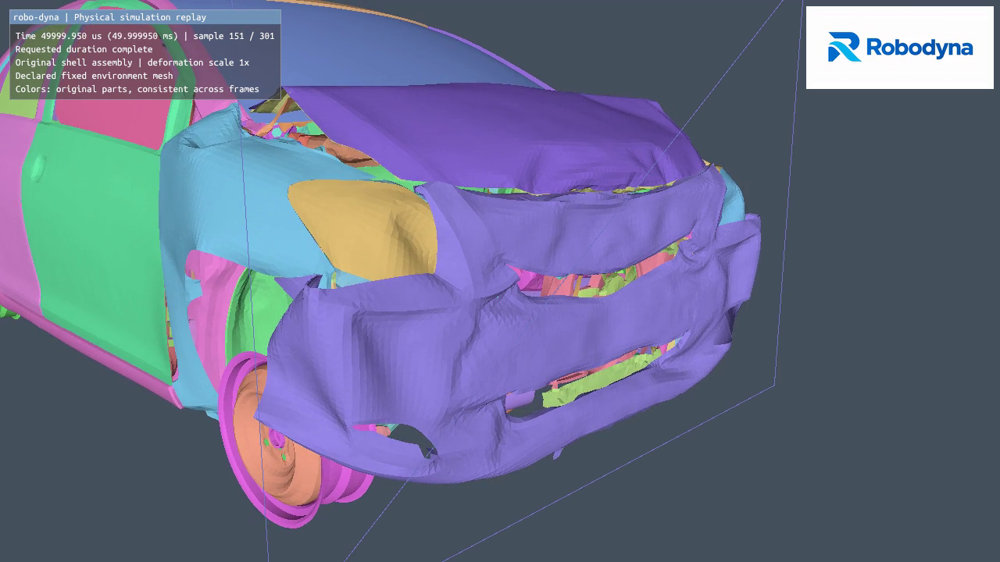
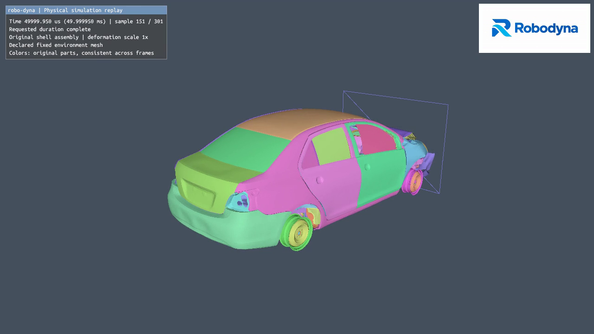
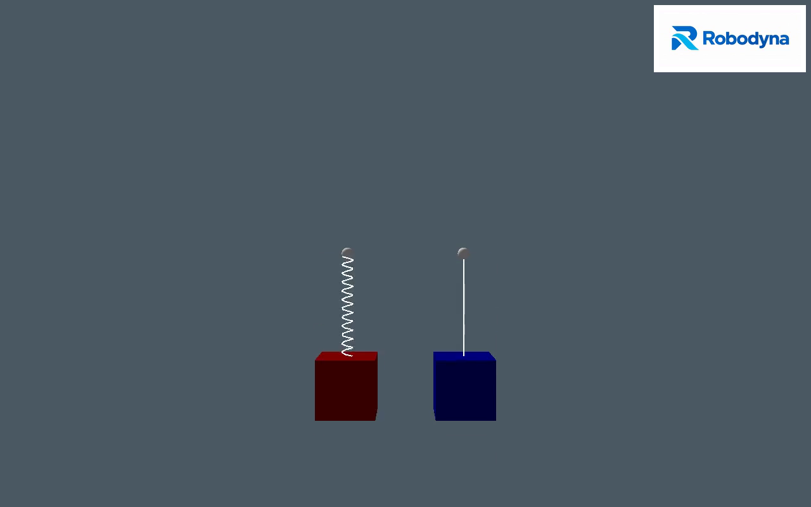
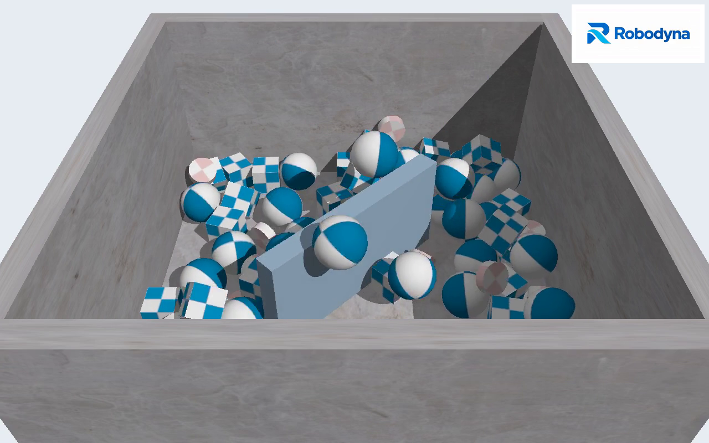
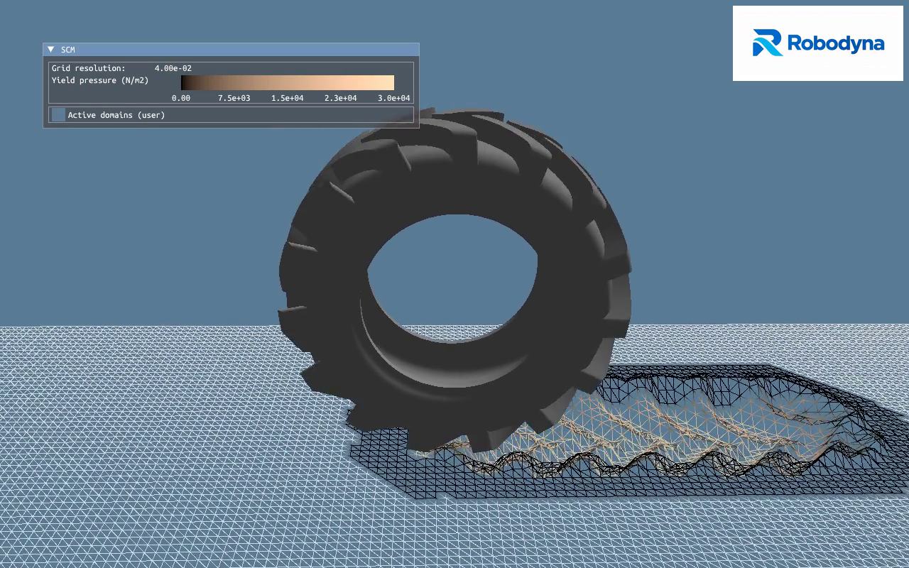

# Robodyna

Robodyna is being developed as one source-owned CUDA multiphysics repository
with Bazel as the product build. It absorbs the qualified TL structural solver,
application and all inherited Chrono capabilities. FEA and multibody dynamics are being separated into sibling modules with shared
mechanics contracts and explicit coupling. The current production backend still
uses the qualified combined owner while those boundaries are extracted.

## Simulation videos

Robodyna-branded videos from recorded simulations. **Yaris uses CUDA FEA**;
the retained **spring, rigid-body contact and SCM examples use CPU physics**.
All five views use Vulkan GPU rendering. See the linked qualification records
for the tested scope and source provenance. The [media record](docs/verification/README_MEDIA.json)
links these branding-only derivatives to the unchanged original recordings.

### Yaris wall crash — front view

100 ms of simulated impact with wall and self-contact, shown in 60.2 seconds of
slow-motion playback. The selected vehicle assembly includes elastic/plastic
deformation; inflated tires remain outside this profile.

https://github.com/user-attachments/assets/4cfb21e2-523d-4213-b972-0cd51a54cb23

Robodyna poster

### Yaris wall crash — overview

The same 100 ms trajectory, with the complete selected assembly and mesh wall
visible. Parts keep their own colors and deformation is shown at physical scale.

https://github.com/user-attachments/assets/1a967b5f-5ec1-4625-b6d5-8f6fbb1c0480

Robodyna poster

### Spring dynamics

Six seconds of the retained spring–mass example. Its native and callback force
models produce matching motion. [Evidence](docs/verification/CHRONO_DEMOS.md).

https://github.com/user-attachments/assets/c71d3a4b-5407-471d-889e-eb5fec439729

Robodyna poster

### Rigid-body collisions

Six seconds with all 87 falling objects and the rotating mixer, using the retained
Bullet/NSC contact model. [Evidence](docs/verification/CHRONO_DEMOS.md).

https://github.com/user-attachments/assets/6491834e-1e89-4f9c-a13b-4791a51b063d

Robodyna poster

### SCM wheel and deformable soil

Six seconds of the retained lugged-wheel example, with soil deformation and a
visible rut. [Evidence](docs/verification/CHRONO_DEMOS.md).

https://github.com/user-attachments/assets/19331faa-c72e-47ab-8ea8-2d91613647d8

Robodyna poster

## Current migration status

This branch is in active restructuring. Source retention, build qualification,
functional qualification and CUDA coverage are tracked separately. Historical
names and aggregate backends are temporary compatibility boundaries. The current
100 ms Yaris result remains preserved outside this repository.

Start with [the execution plan](docs/migration/EXECUTION.md),
[the module architecture](docs/architecture/MODULES.md),
[the source manifest](docs/migration/SOURCES.json), and
[the capability coverage](docs/migration/CAPABILITIES.md).

The native solver, application and VSG viewer now build through the root Bazel
graph. The normal CLI passed the short vehicle regression with byte-identical
recorded output. See [the evidence](docs/migration/QUALIFICATION.json) for the
exact scope; full domain independence and optional-module coverage remain work
in progress. [Operating the product](docs/migration/OPERATING.md) gives the build,
run, inspect and render commands; [build notes](build_defs/README.md) describe SDKs.

The original MBD/SCM setups run through this repository's Bazel build. Their
complete telemetry matched between headless and captured runs, and their videos
passed full decoding. [Qualification and commands](docs/verification/CHRONO_DEMOS.md)
record timesteps, measured behavior and reproducible entry points.

## Chrono acknowledgement and source cutoff

We thank the [Project Chrono Development Team and contributors](https://projectchrono.org/)
for the simulation infrastructure and examples on which this work builds.
Project Chrono's [retained BSD license](src/compatibility/chrono/LICENSE) and
copyright notices remain in place.

The imported local-fork snapshot is
`a5ec9bf5463d7c5ef98817a23051fa07fc0a8a38`
([source commit](https://github.com/zzhou292/robodyna/commit/a5ec9bf5463d7c5ef98817a23051fa07fc0a8a38)),
dated **2026-09-11**. Its baseline import into Robodyna occurred on **2026-09-30**
([import commit](https://github.com/zzhou292/robodyna/commit/557e501b926526ca1ca918d670a2abd80b19cfdb)).
These dates identify our local source snapshot and import, not an official upstream
release or synchronization date. Robodyna develops independently from this pinned
snapshot and does not automatically synchronize with Chrono upstream.
The [source manifest](docs/migration/SOURCES.json) records the exact revisions.

Licenses differ by component. OpenRadioss-derived ports retain their
[AGPL-3.0 notices](src/fea/legacy/lib_src/collision/radioss_type25/LICENSE.md);
the Chrono BSD license is not a blanket license for the whole repository.

## Source and data policy

Component licenses and original attribution notices are retained. Imported source histories remain
reachable. Large result archives, binaries, build caches and videos stay outside
source control; the videos above are linked public media. Required test fixtures and tracked model assets retain their
original identity; Git LFS objects are accounted separately from Git blobs.
