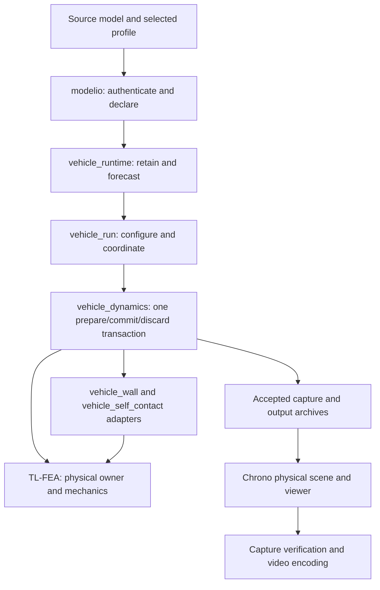

# Robo-dyna architecture and source guide

This guide describes implemented ownership and source boundaries. Changing
runtime status, qualified revisions, receipts, and the paused/resume state live
in the workspace [execution plan](../../planning/CURRENT_EXECUTION_PLAN.md).
The [delivery roadmap](YARIS_DELIVERY_PLAN.md) describes remaining functionality.

## Ownership and dependency direction

Robo-dyna is the application composition layer. TL-FEA owns physical state,
formulations, explicit advancement, contact algorithms, and publication of a
successful trial. Chrono supplies geometry, archives, and rendering utilities.
This follows the existing modular approach: each block owns its state and
contract, while a small coordinator orders calls between blocks.



The diagram shows composition and data flow, not a second dynamics pipeline.
Only accepted physical state flows into normal result publication. Rendering
never drives mechanics, changes physical time, scales deformation, or invents
intermediate geometry. Replay and source preparation can be used without
running a solver.

## Source map and editing boundaries

| Concern | Main source entry | What belongs here |
| --- | --- | --- |
| Original source provenance | [`modelio/`](../modelio/), [`models/`](../models/) | Source card interpretation, declaration identity, selected geometry and original unsupported-card provenance |
| Preparation commands | [`tools/`](../tools/) | CLI argument handling around reusable modelio operations |
| Runtime source and startup | [`case/vehicle_runtime/`](../case/vehicle_runtime/) | Retained execution/attachment inputs, mapped participants, startup and phase-aware budgets |
| Physical transaction | [`VehiclePhysicalDynamics.h`](../case/vehicle_dynamics/VehiclePhysicalDynamics.h), [`Trial.cpp`](../case/vehicle_dynamics/Trial.cpp) | Ordered calls to existing TL operators, typed rejection, common publication, accepted observations |
| Mesh-wall composition | [`case/vehicle_wall/`](../case/vehicle_wall/), [`loaded/`](../case/vehicle_wall/loaded/) | Authenticated wall selection/placement and wall contribution to the shared owner |
| Self-contact composition | [`SelfContactFactories.h`](../case/vehicle_self_contact/SelfContactFactories.h), [`runtime/`](../case/vehicle_self_contact/runtime/) | Source binding, first-profile setup, budgets, TL transaction calls, typed failures and scratch receipts |
| Run orchestration | [`Run.h`](../case/vehicle_run/Run.h), [`Session.cpp`](../case/vehicle_run/Session.cpp), [`Loop.cpp`](../case/vehicle_run/Loop.cpp) | Explicit contact profile, source-backed factory choice, acceptance loop, stop/prefix handling and summaries |
| Accepted capture | [`vehicle_dynamics/output/`](../case/vehicle_dynamics/output/) | Authenticated reads of committed coordinates, native material fields and activity |
| Archive records | [`output/physical_frames/`](../output/physical_frames/), [`output/physical_run/`](../output/physical_run/) | Bounded records, source inventories, hashes, create-only publication and immutable replay |
| Scene geometry | [`chrono/full_shell/`](../chrono/full_shell/), [`chrono/physical_run/`](../chrono/physical_run/) | Physical-to-display mapping, original part colors, field applicability and exact saved-state seek |
| Capture and media | [`viewer/video/`](../viewer/video/), [`viewer/postprocess/`](../viewer/postprocess/) | Verified captures, deliberate saved-state holds, encoding and post-run sequencing |
| Measurement | [`benchmarks/`](../benchmarks/), [`analysis/`](../analysis/) | Timing and interpretation of real outputs without feeding measurements back as mechanics |

Public owning headers describe the usable contract. Private `Storage`, `State`,
`Detail`, and `Internal` helpers should stay inside their module. Put physical
formulas and reusable contact algorithms in TL-FEA; put case selection and
application error presentation here. Use existing native participant APIs and
Chrono adapters before adding new implementations.

## One physical attempt

[`Trial.cpp`](../case/vehicle_dynamics/Trial.cpp) and
[`VehiclePhysicalDynamics.cpp`](../case/vehicle_dynamics/VehiclePhysicalDynamics.cpp)
make the sequencing explicit:

1. Authenticate the accepted owner and actual accepted CIN witness activity.
2. Begin one trial and assemble accepted structural contributions in fixed
   family order, followed by configured wall and self-contact contributions.
3. Upload the accepted witness, seal assembly, and invoke TL's CIN/rigid advance
   with the configured post-CIN structural screen.
4. Evaluate all structural candidates and prepare the common publication.
5. Validate the wall candidate and seal continuous self-contact geometry through
   the same trial identity.
6. Copy/validate prepared fields and observations. The fallible preparation path
   completes before `CommitStep`.
7. Authenticate scratch participation and commit every declared participant
   through the common publisher. A failed attempt is discarded; accepted state
   and history remain authoritative.
8. The run controller appends the authenticated accepted interval and captures
   frames at the declared cadence. It closes a complete horizon or an explicitly
   labeled accepted prefix.

Wall and self-contact are contributions to this transaction. They do not own an
independent nodal clock. Candidate observations are not accepted output. Archive
I/O failure after a physical commit leaves incomplete output; it cannot fabricate
a successful archive or retroactively undo the committed mechanics.

## Self-contact module boundaries

The app's [`vehicle_self_contact`](../case/vehicle_self_contact/) module owns:

- `SelectedSelfContactSource`: authenticating the selected original surface.
- `VehicleSelfContactSetup` and `VehicleSelfContactStartup`: retained source
  bindings and the declared first contact profile.
- `RuntimeBudget`: combined retained/startup/device forecasts.
- `runtime/Operations` and `runtime/Stages`: accepted-force assembly,
  candidate sealing, scratch receipts, and discard through TL's transaction.
- `SelfContactStageError`: copied typed failure context for the controller.

TL-FEA owns discovery, deterministic feature identity/ownership, force and
stiffness assembly, continuous certificates, and bounded storage. Numerical
branches and fixtures are pinned in the workspace plan. Do not copy these
algorithms into app diagnostics or renderers.

The first profile is frictionless centered-shell contact with fixed Q4/T3
facets. It is not exact bilinear Q4 contact; solid/beam contact surfaces and
persistent friction history remain future profiles. The current path includes
host feature/certificate work, so a CUDA physical owner does not imply that
whole contact qualification executes on the GPU.

## Results and rendering

[`output/physical_run`](../output/physical_run/README.md) owns the archive and
source authentication contract. Its replay reader checks the original model,
record inventory, hashes, epochs and mapping before exposing immutable samples.
[`chrono/physical_run`](../chrono/physical_run/README.md) presents those samples
at physical scale with actual field availability and part identity.

[`viewer/file_integrity.py`](../viewer/file_integrity.py) supplies only bounded
streaming file hashing for host postprocessing and capture verification. Schema,
completion, and provenance validation remain with the archive/capture owners.
`lifecycle.sha256` and `capture.sha256_file` remain compatible import names.
The encoder separately hashes bytes while streaming each PNG to the media
process so a concurrent input change cannot silently produce a valid receipt.

A closed archive, successful scene replay, decoded video, useful camera view,
and physically qualified simulation are separate checks. Recovered saved
samples have explicitly unavailable interval history. Neither normal nor
recovered visualization is a physical restart checkpoint.

## Validation and build entry points

Use the existing bounded runner and workstation lock for tests/builds. During
the current pause, no GPU smoke test, full vehicle traversal, or heavy rebuild
is part of architecture cleanup. The execution plan records current resource
limits; a discussed allowance is not an applied launch configuration.

| Change | First relevant verification |
| --- | --- |
| Source interpretation | Owning `modelio`/`tests` host tests and source proofs; actual-source coupons only when relevant |
| Pure controller values or formatting | `case/vehicle_run/tests` owning host/value tests |
| Physical stage composition | Focused transaction/publication/rollback tests, then affected original-source acceptance |
| Contact geometry/formula | TL owning unit/frozen-pair tests, CUDA deterministic coupons when applicable, then source-derived and full acceptance tiers |
| Archive schema or reader | Owning physical frame/run roundtrip, corruption, cap and prefix tests; exact Chrono replay |
| Host capture/postprocessing utility | `viewer.postprocess.test_lifecycle`, `viewer.postprocess.test_replay_evidence`, `viewer.video.tests.test_capture`, `viewer.video.tests.test_encode` |
| Documentation only | Verify source paths, current-state claims and links; no full vehicle gate |

The Python viewer tests run without a GPU, renderer, or simulation:

```sh
# From the application directory, within the workspace's bounded host runner:
python3 -B -m unittest viewer.postprocess.test_lifecycle \
  viewer.postprocess.test_replay_evidence viewer.video.tests.test_capture viewer.video.tests.test_encode -v
```

The root CMake file exposes historical coupon options alongside current
modules. Standalone module `CMakeLists.txt` files reduce dependency scope; for
example `chrono/physical_run` can build CPU scene checks without CUDA or the
vehicle dynamics factory. Reuse the qualified cache and explicit TL worktree
when a numerical rebuild is actually needed. Preserve old build trees and
reports as evidence; do not turn documentation cleanup into a configure/build.

## Refactoring priorities

The broad layering is already useful. Readability problems are concentrated in
chronological entry documentation, scattered legacy build options, and large
TL continuous-certificate/transaction translation units. Improve these at the
owning boundary:

- Keep root/module entry documents focused on responsibilities and links;
  preserve historical evidence separately from current instructions.
- Extract private numerical helpers only after defining their ownership,
  unchanged operation order, and the exact frozen replay/differential tests.
- Measure performance at existing stage boundaries before changing scheduling
  or moving host work to CUDA. Preserve admitted outcomes and failure behavior.
- Avoid generic utility collections, duplicate parsers, renamed public types,
  moved source paths, or new plugin frameworks without an actual reuse need.

These are maintenance directions, not claims that deferred numerical or build
refactors have already been implemented.
