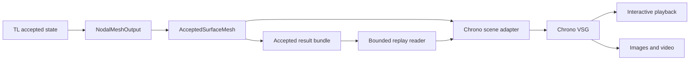

# Rendering accepted deformation in robo-dyna

Source audit: 2026-09-09. Rendering the vehicle crashing and deforming is part of
the final deliverable. Build the output and playback path alongside the small
deforming coupons; a folder of mesh files alone does not complete that work.
The [Yaris delivery plan](YARIS_DELIVERY_PLAN.md) remains the mechanics backlog.

## Current implementation and ownership

TL-FEA owns accepted positions, rotations and simulation time. Robo-dyna maps
those results to a visual surface; Chrono::VSG owns scene presentation. An
offline viewer reads saved accepted results and can run after CUDA simulation
has exited. It neither creates a second FEA model nor steps Chrono dynamics.

The complete archive → reader → scene → VSG path now has actual runtime evidence.
The isolated Chrono core+VSG build replayed 15 normal-contact rig frames and
81 accepted elastic-coupon frames on the RTX 5090. Their
[R0/R1 checkpoint](../../crash-work/reports/vsg-r0-r1-runtime-checkpoint-1.json)
records source/image hashes, visual review and resource measurements. The
[separate R1 video manifest](../../crash-work/renders/elastic-coupon-video-r1-20260909/manifest.json)
binds an 81-frame, 8.1 s H.264 video to those exact accepted rows and records
full-decode and decoded-image visual checks. These qualify the small fixtures;
plate-wall, source-part and full-vehicle rendering remain later gates.

| Existing owner | Reuse and limit |
| --- | --- |
| [`NodalMeshOutput`](../chrono/NodalMeshOutput.h) | Copies only the TL owner's accepted state at caller-selected cadence. It currently has fixed 64-node readback storage and also copies velocities although rendering uses positions. |
| [`AcceptedSurfaceMesh`](../chrono/AcceptedSurfaceMesh.h) | Stages mapped positions, validates run/topology/time and rejects invalid publication. Keeps one mutable, fixed-connectivity `ChVisualShapeTriangleMesh` handle. Preview limits are 4,096 vertices/8,192 triangles. |
| [`NormalImpactArtifacts`](../case/NormalImpactArtifacts.h) | Writes indexed accepted times, full-precision Chrono JSON meshes, visualization-precision OBJ and a hashed completed manifest. Its case-specific physics/configuration stays with the case. |
| Chrono core | `ChTriangleMeshConnected`, `ChVisualShapeTriangleMesh`, visual materials, fixed visual carriers and existing JSON archive operations. |
| Chrono::VSG | Mutable mesh updates, lighting, cameras, interaction and PNG capture. Reuse the local [VSG manual](../../chrono/doxygen/documentation/manuals/visualization/vsg_visualization.md) and [deformable wave demo](../../chrono/src/demos/vsg/demo_VSG_wave.cpp); copy the visual setup pattern, with TL/saved frames supplying motion. |

The current coupon bundle includes immutable run/topology/source binding and
accepted field metadata. Those identities refer to the synthetic coupon.
The old normal-contact rig lacks the newer binding tables and remains explicitly
labelled geometry playback. Neither bundle establishes source-aware vehicle
playback; original vehicle IDs must survive compilation, partitioning and replay
before that separate gate.

## Current small modules

1. **AcceptedReplay** in `robo-dyna/output` verifies manifests, frame order,
   hashes, bounded Chrono JSON meshes and immutable topology. Shared `ArtifactIO`
   and `MeshArchive` utilities also serve both case writers. Validation streams
   the trajectory and computes camera bounds; playback retains the current
   frame plus bounded staging. It is a geometry/provenance reader, not an audit
   of the entire physics ledger.
2. **AcceptedReplayScene** in `robo-dyna/chrono` owns fixed identity-frame visual
   carriers, the actual wall when supplied, camera/material configuration and
   one mutable shape per surface. It stages accepted coordinates and preserves
   published geometry on failure. It invents no TL owner or physical source IDs.
3. **robo_dyna_replay** in `robo-dyna/viewer` composes the reader and scene,
   presents controls and captures indexed PNGs. It links optionally against
   installed `Chrono::Chrono_vsg` through Chrono's external-project pattern.
   Numerical tests remain buildable without VSG. Offline video encoding is a
   separate bounded tool step, documented in [VIDEO.md](../viewer/VIDEO.md).

No solver equations, contact computation or file-format parsing belongs in the
viewer entry point. Avoid a generic visualization framework until there is a
second real consumer. The existing source namespace `crash::visual` can remain
an internal compatibility detail; product UI/CLI naming is robo-dyna.

## Deforming mesh details established by source inspection

The local [mutable VSG binder and render loop](../../chrono/src/chrono_vsg/ChVisualSystemVSG.cpp)
already copy current mesh coordinates to dynamic GPU buffers on `Render()`.
For this path it expands faces into a triangle soup and calls
[`GetFaceNormals()`](../../chrono/src/chrono/geometry/ChTriangleMeshConnected.cpp)
each rendered frame. Begin with those recomputed flat normals; changing mesh
vertices must visibly change both the silhouette and lighting. CPU mesh values
remain binary64; VSG display buffers are float, an explicit presentation boundary.

Keep display triangulation separate from FE integration/contact weights. Carry
the physical parent element/face and subtriangle IDs already represented in
`TriangleBinding`. Extract shell display surfaces and solid exterior faces from
the compiled model with stable node bindings; draw beam/connector diagnostics
from their own endpoints. Shared physical nodes may have multiple display
vertices for material boundaries without creating duplicate physical DOFs.
Start with shell midsurfaces. Later thickness surfaces require accepted directors
and declared section offsets; they may not be synthesized as collision physics.

Two concrete VSG limits need attention before promotion:

- **Materials:** `PopulateVisualShapesMutable` records one vertex buffer and
  expects all mesh triangles in it. The PBR builder partitions multiple
  materials into separate buffers. Initially use one material per mutable
  shape, grouping by part/material, or explicit face colors. Qualify two
  independently deforming parts before a multi-material vehicle. Do not assume
  one mesh with many PBR materials updates correctly in this checkout.
- **Topology:** current publication and VSG buffers assume fixed connectivity.
  `BindAll()` appends bindings; it is not a safe per-frame topology replacement.
  Deletion/fracture needs a topology epoch and a qualified replacement of the
  affected scene resources, or an explicit visibility operation. Until that
  exists, reject topology-changing playback instead of showing stale faces.

Part-based colors, a clear wall, a fixed reference camera and optional wireframe
are sufficient for the first engineering render. Scalar contours are added only
when accepted, phase-labelled element/node fields exist; do not infer stress
from visible deformation. Preserve sharp part boundaries if smooth shading is
added later, and qualify normals at folds and on both shell sides.

## Cadence, playback and workstation budget

Publish only after a TL commit. Record actual accepted time even when output
sampling skips solver epochs. A target output interval is separate from both
the stable solver step and playback FPS; it never changes force integration.
Begin vehicle output experiments at 1 ms sampling, then refine around contact
and folding until motion is adequately resolved. That is a proposed output
budget, not a physics time-step choice or a proven sufficient visual cadence.

The current replay advances through saved accepted rows at the requested
presentation FPS and labels recorded simulation time. Pause and next-frame
controls exist; backward seek and interpolation are not implemented. Any later
seek must rebuild the replay cursor/scene consistently, and any interpolation
must remain presentation-only, never simulation evidence or a restart state.

Chrono captures the previous rendered swapchain image. Offline export therefore
renders each accepted row once, holds geometry/time unchanged and requests
`WriteImageToFile()` **before** a second `Render()`. One initial uncaptured
render lets ImGui establish the overlay layout. `SetTargetRenderFPS(0)` disables
the limiter that could otherwise skip a capture. Map every image to its recorded epoch/time; verify each requested image
exists before encoding a video, then verify dimensions, frame count, duration
and full decode. Headless/offscreen Vulkan is a separate runtime gate, not a
claim based on the existence of image-capture APIs.

The shell display alone has 695,433 triangles: the current VSG mutable path
expands these to 2,086,299 display vertices. Position/normal/color/UV/index arrays
are approximately **104 MiB of raw render data**, before host mirrors, transfer
buffers, solid surfaces, materials, driver allocations or shadows. One full
393,165-node binary64 position frame is about 9 MiB; 201 such frames already
approach 1.77 GiB before archive overhead. Measure peak memory and bytes/frame;
streaming and bounded staging are required, and the current 64-node/preview
caps must not be silently raised to claim full-vehicle readiness.

Use the shared resource guard/lock for viewer builds and GPU runs, with one build
job, at most two CPU affinity slots and the existing 32 GiB RAM/8 GiB VRAM
reserves. Start offline so solver and renderer do not compete for GPU memory.
The original VSG implementation creates a **16-thread loading pool**. The local
`SetLoadingThreadCount`/getter and locking before initialization passed three
owning CPU lifecycle tests and both actual one-worker replay runs. CPU
affinity alone does not reduce thread creation. Inspect installed dependencies
first; use the checked-out [VSG build guidance](../../chrono/doxygen/documentation/installation/module_vsg_installation.md)
and pinned contributor script if a bounded separate VSG build is needed.

The initial dependency audit found only the Vulkan loader/NVIDIA ICD. Required
headers, glslang, VSG, vsgXchange, vsgImGui and Chrono core+VSG are now prepared,
built and installed in isolated workspace prefixes. The actual donor script is
[`contrib/build-scripts/linux/buildVSG.sh`](../../chrono/contrib/build-scripts/linux/buildVSG.sh).
Reuse its pinned configure options; do not run it unchanged: its defaults enable
download/debug builds, delete the install prefix, use unbounded Ninja workers
and can append to `.bashrc`. Build a bounded Release variant with one worker,
preserve existing prefixes/settings, and record dependency revisions/licenses.
The dependency lock, retained corrective overlay, build and runtime details are
in [viewer/DEPENDENCIES.md](../viewer/DEPENDENCIES.md). R0 peaked at 281 MiB
sampled RSS / 125 MiB device-wide GPU growth; R1 at 298 MiB / 135 MiB. These are
small-fixture observations, not a full-vehicle allocation forecast. The local
FFmpeg package only performs offline encoding; it is not linked into the CAE app.

## Promotion gates and concrete artifacts

| Gate | Required check | Exit artifact |
| --- | --- | --- |
| **R0: archived rig replay — passed** | All 15 accepted rows at 0–70 ms replayed with the real fixed wall. Reader/scene tests, image hashes, original timestamps and direct visual review passed. The original failed visual attempt is retained separately. | [Passing rig capture](../../crash-work/renders/normal-rig-r0-20260909-retry2/manifest.json), labelled a nondeforming contact rig. |
| **R1: mutable deformation — passed for the coupon** | All 81 accepted coupon shapes replayed without rebinding or deformation scaling; no wall is present in this case. Six scene checks and three VSG lifecycle tests passed. First/middle/final decoded video frames preserve silhouette and timestamps. | [Coupon captures](../../crash-work/renders/elastic-coupon-r1-20260909/manifest.json) and [8.1 s video](../../crash-work/renders/elastic-coupon-video-r1-20260909/elastic-coupon.mp4), with separate hash/probe/full-decode provenance. Headless rendering remains unqualified. |
| **R2: guided plate impact** — M5a.1 | Render real accepted plate-wall frames with nonuniform contact/bending and the same source-bound topology/units as diagnostics. Hide/show parts and wireframe are display-only. | Replayable plate impact and video, with accepted time linked to force/energy histories. |
| **R3: source parts and capacity** — M7/M8 | Source IDs/material colors survive import, archive, replay and display partitioning. Benchmark representative batches, then original vehicle surface, measuring staging/render/readback time and owned/total memory. Test deterministic capacity rejection and cleanup. | Readable source-part rendering and bounded full-vehicle static/deformation playback qualification; no physics claim from prescribed motion. |
| **R4: complete vehicle crash** — M9/M10 | Replay the accepted crash to 200 ms, including topology changes only after their gate. Verify frame coverage, wall placement, permanent deformation and complete video decode. A fixed camera and simulation-time overlay allow direct review. | The deliverable includes the result bundle, interactive replay instructions and a rendered vehicle-crash video. |

Do not use an exact-pixel golden image across drivers as a physics test. Keep
numeric geometry/time/provenance checks deterministic, and use repeatable camera
settings plus direct visual review for clipping, lighting and visible deformation.
