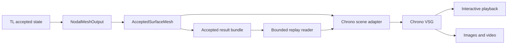

# Rendering accepted deformation in robo-dyna

Source audit: 2026-09-09. Rendering the vehicle crashing and deforming is part of
the final deliverable. Build the output and playback path alongside the small
deforming coupons; a folder of mesh files alone does not complete that work.
The [Yaris delivery plan](YARIS_DELIVERY_PLAN.md) remains the mechanics backlog.

## Current implementation and proposed boundary

TL-FEA owns accepted positions, rotations and simulation time. Robo-dyna maps
those results to a visual surface; Chrono::VSG owns scene presentation. An
offline viewer reads saved accepted results and can run after CUDA simulation
has exited. It neither creates a second FEA model nor steps Chrono dynamics.

The live output arrows through mesh archives exist. The replay reader, VSG
scene adapter, viewer and image/video acceptance gates are still pending.
The current `chrono-core` build has `CH_ENABLE_MODULE_VSG=OFF`; no VSG window or
rendered animation has been qualified in this project.

| Existing owner | Reuse and limit |
| --- | --- |
| [`NodalMeshOutput`](../chrono/NodalMeshOutput.h) | Copies only the TL owner's accepted state at caller-selected cadence. It currently has fixed 64-node readback storage and also copies velocities although rendering uses positions. |
| [`AcceptedSurfaceMesh`](../chrono/AcceptedSurfaceMesh.h) | Stages mapped positions, validates run/topology/time and rejects invalid publication. Keeps one mutable, fixed-connectivity `ChVisualShapeTriangleMesh` handle. Preview limits are 4,096 vertices/8,192 triangles. |
| [`NormalImpactArtifacts`](../case/NormalImpactArtifacts.h) | Writes indexed accepted times, full-precision Chrono JSON meshes, visualization-precision OBJ and a hashed completed manifest. Its case-specific physics/configuration stays with the case. |
| Chrono core | `ChTriangleMeshConnected`, `ChVisualShapeTriangleMesh`, visual materials, fixed visual carriers and existing JSON archive operations. |
| Chrono::VSG | Mutable mesh updates, lighting, cameras, interaction and PNG capture. Reuse the local [VSG manual](../../chrono/doxygen/documentation/manuals/visualization/vsg_visualization.md) and [deformable wave demo](../../chrono/src/demos/vsg/demo_VSG_wave.cpp); copy the visual setup pattern, with TL/saved frames supplying motion. |

The current result bundle preserves mesh positions/connectivity and accepted
owner/time, but does **not** serialize the complete `Binding` source-node,
element, part, run and topology identity tables. Add that immutable metadata
before claiming source-aware vehicle playback. Old rig bundles remain valid
geometry playback inputs, explicitly lacking those new semantic fields.

## Small modules to implement

1. **Accepted result reader** in `robo-dyna/output`: read the existing manifest
   and frame index, verify bounded files/hashes, load Chrono JSON meshes and
   expose recorded time/epoch with immutable topology. Extract shared bounded
   read/hash/archive helpers from `NormalImpactArtifacts` when adding this
   second consumer; retain its case metrics and completion checks separately.
   The reader streams a current frame and bounded prefetch, not the whole run.
2. **Scene adapter** in `robo-dyna/chrono`: own an identity-frame fixed visual
   carrier, the actual wall shape, camera/material configuration and attached
   mutable meshes. Live publication consumes `AcceptedSurfaceMesh`; replay
   consumes validated archived geometry. Keep these two input paths explicit;
   never invent a TL owner or physical source IDs for an old mesh archive.
3. **Thin replay executable** in `robo-dyna/viewer`: parse a result directory,
   choose camera/playback/export options and call the reader and scene adapter.
   Build it optionally against installed/built `Chrono::VSG` using Chrono's
   external-project pattern. Numerical tests remain buildable without VSG.

No solver equations, contact computation or file-format parsing belongs in the
viewer entry point. Avoid a generic visualization framework until there is a
second real consumer. The existing source namespace `crash::visual` can remain
an internal compatibility detail; product UI/CLI naming is robo-dyna.

## Deforming mesh details established by source inspection

The local [mutable VSG binder and render loop](../../chrono/src/chrono_vsg/ChVisualSystemVSG.cpp)
already copy current mesh coordinates to dynamic GPU buffers on `Render()`.
For this path it expands faces into a triangle soup and calls
[`GetFaceNormals()`](../../chrono/src/chrono/geometry/ChTriangleMeshConnected.cpp)
each rendered frame. Begin with those recomputed flat normals; changing mesh
vertices must visibly change both the silhouette and lighting. CPU mesh values
remain binary64; VSG display buffers are float, an explicit presentation boundary.

Keep display triangulation separate from FE integration/contact weights. Carry
the physical parent element/face and subtriangle IDs already represented in
`TriangleBinding`. Extract shell display surfaces and solid exterior faces from
the compiled model with stable node bindings; draw beam/connector diagnostics
from their own endpoints. Shared physical nodes may have multiple display
vertices for material boundaries without creating duplicate physical DOFs.
Start with shell midsurfaces. Later thickness surfaces require accepted directors
and declared section offsets; they may not be synthesized as collision physics.

Two concrete VSG limits need attention before promotion:

- **Materials:** `PopulateVisualShapesMutable` records one vertex buffer and
  expects all mesh triangles in it. The PBR builder partitions multiple
  materials into separate buffers. Initially use one material per mutable
  shape, grouping by part/material, or explicit face colors. Qualify two
  independently deforming parts before a multi-material vehicle. Do not assume
  one mesh with many PBR materials updates correctly in this checkout.
- **Topology:** current publication and VSG buffers assume fixed connectivity.
  `BindAll()` appends bindings; it is not a safe per-frame topology replacement.
  Deletion/fracture needs a topology epoch and a qualified replacement of the
  affected scene resources, or an explicit visibility operation. Until that
  exists, reject topology-changing playback instead of showing stale faces.

Part-based colors, a clear wall, a fixed reference camera and optional wireframe
are sufficient for the first engineering render. Scalar contours are added only
when accepted, phase-labelled element/node fields exist; do not infer stress
from visible deformation. Preserve sharp part boundaries if smooth shading is
added later, and qualify normals at folds and on both shell sides.

## Cadence, playback and workstation budget

Publish only after a TL commit. Record actual accepted time even when output
sampling skips solver epochs. A target output interval is separate from both
the stable solver step and playback FPS; it never changes force integration.
Begin vehicle output experiments at 1 ms sampling, then refine around contact
and folding until motion is adequately resolved. That is a proposed output
budget, not a physics time-step choice or a proven sufficient visual cadence.

The baseline replay holds the most recent saved accepted frame at the requested
playback time and labels simulation time/playback speed. Seek rebuilds the
replay cursor/scene consistently; it does not bypass the live adapter's monotone
accepted-time rule. Interpolation, if later offered, is presentation-only and
must never become simulation evidence or an accepted restart state.

Offline export requests `WriteImageToFile()` **before** the corresponding
`Render()` call and disables the VSG real-time frame limiter with
`SetTargetRenderFPS(0)`. The current limiter can skip an entire render before
capture. Map every image to its recorded epoch/time; verify each requested image
exists before encoding a video, then verify dimensions, frame count, duration
and full decode. Headless/offscreen Vulkan is a separate runtime gate, not a
claim based on the existence of image-capture APIs.

The shell display alone has 695,433 triangles: the current VSG mutable path
expands these to 2,086,299 display vertices. Position/normal/color/UV/index arrays
are approximately **104 MiB of raw render data**, before host mirrors, transfer
buffers, solid surfaces, materials, driver allocations or shadows. One full
393,165-node binary64 position frame is about 9 MiB; 201 such frames already
approach 1.77 GiB before archive overhead. Measure peak memory and bytes/frame;
streaming and bounded staging are required, and the current 64-node/preview
caps must not be silently raised to claim full-vehicle readiness.

Use the shared resource guard/lock for viewer builds and GPU runs, with one build
job, at most two CPU affinity slots and the existing 32 GiB RAM/8 GiB VRAM
reserves. Start offline so solver and renderer do not compete for GPU memory.
The local VSG implementation unconditionally creates a **16-thread loading
pool** and exposes no public count setter. Add a small validated pre-initialize
Chrono setting for that pool and select one worker for the first smoke; CPU
affinity alone does not reduce thread creation. Inspect installed dependencies
first; use the checked-out [VSG build guidance](../../chrono/doxygen/documentation/installation/module_vsg_installation.md)
and pinned contributor script if a bounded separate VSG build is needed.

The 2026-09-09 local dependency audit found the Vulkan loader/NVIDIA ICD, but
no Vulkan development headers, `pkg-config vulkan` entry, VSG, vsgXchange or
vsgImGui installations in the workspace and inspected local prefixes. R0
therefore starts with dependency preparation in an isolated workspace prefix.
The actual donor script is
[`contrib/build-scripts/linux/buildVSG.sh`](../../chrono/contrib/build-scripts/linux/buildVSG.sh).
Reuse its pinned configure options; do not run it unchanged: its defaults enable
download/debug builds, delete the install prefix, use unbounded Ninja workers
and can append to `.bashrc`. Build a bounded Release variant with one worker,
preserve existing prefixes/settings, and record dependency revisions/licenses.
The audit did not install anything or qualify an actual Vulkan window.

## Promotion gates and concrete artifacts

| Gate | Required check | Exit artifact |
| --- | --- | --- |
| **R0: archived rig replay** — parallel to force work | Read the retained `robo-dyna-smoke-20260909` bundle; verify all 15 frame entries at 0–70 ms and the actual wall. Reader tests reject corruption, wrong counts/connectivity, nonfinite coordinates, out-of-order time and incomplete success claims. | A VSG window and 15 indexed screenshots of the moving mass patch. Label it a nondeforming contact rig. This is available input, not a completed rendering gate. |
| **R1: mutable deformation** — with elastic coupon | Two distinct nonuniformly deformed accepted shapes update without rebinding, stale vertices or normals; wall stays fixed. Test no renderer mutation of solver state, correct part colors, failed frame preservation and replay/live coordinate agreement. | Fixed-camera before/bent images and an indexed short video of the actual elastic coupon. Inspect silhouette, normals, clipping and timestamps. |
| **R2: guided plate impact** — M5a.1 | Render real accepted plate-wall frames with nonuniform contact/bending and the same source-bound topology/units as diagnostics. Hide/show parts and wireframe are display-only. | Replayable plate impact and video, with accepted time linked to force/energy histories. |
| **R3: source parts and capacity** — M7/M8 | Source IDs/material colors survive import, archive, replay and display partitioning. Benchmark representative batches, then original vehicle surface, measuring staging/render/readback time and owned/total memory. Test deterministic capacity rejection and cleanup. | Readable source-part rendering and bounded full-vehicle static/deformation playback qualification; no physics claim from prescribed motion. |
| **R4: complete vehicle crash** — M9/M10 | Replay the accepted crash to 200 ms, including topology changes only after their gate. Verify frame coverage, wall placement, permanent deformation and complete video decode. A fixed camera and simulation-time overlay allow direct review. | The deliverable includes the result bundle, interactive replay instructions and a rendered vehicle-crash video. |

Do not use an exact-pixel golden image across drivers as a physics test. Keep
numeric geometry/time/provenance checks deterministic, and use repeatable camera
settings plus direct visual review for clipping, lighting and visible deformation.
