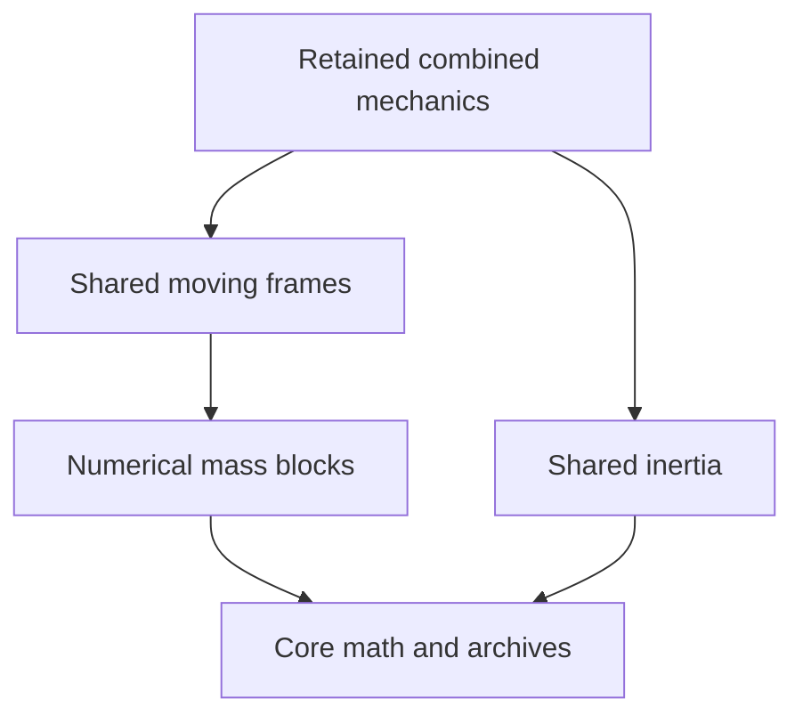

# Robodyna module architecture: FEA, multibody and shared systems

Date: 2026-09-30. Status: proposed architecture after tracing local Chrono classes,
assembly, integration, contact and build dependencies. Source import and native aggregate builds have now executed; independent domain
separation is still pending. See `../migration/EXECUTION.md` for current gates. This is the canonical detailed layout; it replaces the earlier shorthand
`physics/solid` versus `physics/rigid` layout in the platform proposal.

User requirements: full first-party absorption of Chrono and TL-FEA functionality;
one Robodyna product/API and Bazel build; separate FEA and rigid/multibody modules;
reuse existing implementations; preserve working physics and explicit CUDA/resource
contracts. GPU coverage and functional retention are qualified separately.

## Principal decision

Make **FEA** and **multibody dynamics (MBD)** peer modules. FEA owns finite-element
meshes, fields, interpolation, elements, sections, constitutive history and FE
assembly. MBD owns rigid bodies, joints, shafts, motors and multibody models.
Neither is a child of the other.

They share small mechanics and numerical interfaces. Mixed systems and concrete
cross-domain attachments live above both modules. Separate modules can contribute
to one assembled solve/integrator; they are not required to advance independently
and exchange delayed forces. Partitioned FSI is another explicitly selected scheme.

## First implemented ownership split

The native product now uses one root Bazel graph. The first neutral extraction
has the following concrete targets. The combined build and runtime gate passed,
including all 20 test targets and a byte-identical short vehicle regression.

| Target | Owns | Relationship to the retained sources |
| --- | --- | --- |
| `//src/core:foundation` | Math, class factory and archive primitives | 16 unchanged implementation files |
| `//src/numerics/variables:mass_blocks` | Six-DOF mass/inertia variable blocks | 3 unchanged implementation files; no concrete body |
| `//src/mechanics/kinematics:frames` | Moving frames and applied wrench transformations | Existing `ChBodyFrame` implementation |
| `//src/mechanics/inertia:inertia` | Composite inertia and mass properties | Existing `ChMassProperties` implementation |
| `//src/core/configuration:host_headers` | Declared release configuration | Same template values as the qualified aggregate |



These are real compiling libraries. The combined mechanics library excludes their
21 source files, preserving a total of 482 unique original compilation units.
Bazel analysis inspects transitive headers, link owners and actual compile owners;
standalone runtime tests exercise frame power/wrenches, inertia, archives and class
factory retention. These checks are prerequisites for independent FEA/MBD, not a
claim that those larger domains have already been separated.

Source files retain their inherited paths for now so the CMake reference build,
class names and archive identity remain intact. `NEUTRAL_OWNERSHIP.json` in the
migration directory records their current owners and unchanged hashes. Physical
source relocation can follow tested dependency boundaries instead of obscuring
changes to equations inside mass renames.

## What the source establishes

The subsequent API migration has also qualified these generic owners:

| Target | Existing implementation ownership |
| --- | --- |
| `//src/geometry:base` | AABB and base geometry |
| `//src/visualization/material:values` | Color, texture and visual material |
| `//src/visualization/model:model` | Camera, visual shape and visual model |
| `//src/mechanics/object:object` | Generic object identity and visualization attachment |

They own nine additional original translation units. Their actual header/link/
compile closure passes with FEA enabled and without concrete FE or rigid-body
implementations. FE attachment and update definitions live in one explicit adapter
under `src/fea/visualization`, still compiled by the transitional combined backend.
The total is the original 482 units plus that adapter; none of the original
implementations is compiled twice. This completes the visual dependency split,
while mesh/system services, contact reporting and mixed assembly still require work.

The inertia definitions have moved to `robodyna::mechanics`; the initial body,
mesh and system public names remain aliases. `SOURCE_TRANSFORMATIONS.json` in the
migration directory records reviewed edits against the immutable original hashes.
Archive identity helpers preserve captured file formats across actual type renames;
this is distinct from preserving old binary ABI. See `RENAME_QUALIFICATION.json`.

| Current source | Observation | Consequence |
| --- | --- | --- |
| `chrono/physics/ChBody.h:52` | A body derives physics-item, moving-frame, contactable and loadable interfaces | Concrete body state belongs to MBD; supporting interfaces can be shared |
| `chrono/fea/ChMesh.h:41`, `physics/ChIndexedNodes.h:26` | FE meshes derive indexed nodes/physics item, not rigid bodies | FEA is a distinct mechanics participant |
| `physics/ChPhysicsItem.h:35` | Explicitly covers bodies, joints and FEM meshes | Extract/reuse a neutral participant contract |
| `physics/ChBodyFrame.h:23`, `fea/ChNodeFEAxyzrot.h:32` | The moving-frame abstraction is also used by rotational FE nodes | Do not classify every Body-named type as MBD ownership |
| `physics/ChAssembly.h:21–31` | Concrete assembly knows bodies, links, shafts and meshes | Mixed composition belongs above FEA/MBD, not in either domain or an unbounded common bucket |
| `physics/ChSystem.cpp:638`, `:1637` | One descriptor assembles variables/constraints/KRM, then one timestepper advances | Preserve simultaneous mechanical solves and their constraint semantics |
| `fea/ChLinkNodeFrame.cpp:51–53` | Node and frame variables enter the same constraints | Attachment is not automatically loose co-simulation |
| `chrono/CMakeLists.txt:609`, `:1383`, `:1471` | Optional FEA sources join bodies/solvers in one Chrono_core library | Folder/namespace separation today is not independent build separation |
| `chrono_modal/ChModalAssembly.h:39–50` | Modal assembly includes bodies, links and FE meshes | Mixed modal analysis/reduction belongs above individual domains |
| `chrono_peridynamics/ChNodePeri.h:38` | Nonlocal-solid node currently inherits an FE node | Retain the dependency during migration; extract shared node contracts before claiming independence |

Paths in this table are beneath `chrono/src/` (core paths begin beneath
`chrono/src/chrono/`). The inspected Chrono HEAD is `a5ec9bf5463d7c5ef98817a23051fa07fc0a8a38`;
existing dirty third-party state remains untouched. Qualified TL remains
`f0cdeffaef85ea1f97c2162790dbd091fb2e4853`.

## Target source layout

Every substantive package gets its own BUILD.bazel, owning headers, implementation
and focused tests. The diagram names responsibilities, not empty files to generate.

```text
robodyna/
  MODULE.bazel, MODULE.bazel.lock, BUILD.bazel
  .bazelversion, .bazelrc
  build_defs/                     # toolchains, small reusable build rules
  include/robodyna/                # public headers/facades; narrow module APIs
  src/
    core/                         # IDs, units, math, errors, functions, metadata
      serialization/              # archive primitives, class registry and versions
    execution/
      cpu/ cuda/                  # allocators, streams/events, budgets, profiling
    numerics/
      algebra/ operators/         # vectors, matrices, sparse/matrix-free primitives
      linear/ nonlinear/          # mathematical solve algorithms
      constraints/ eigen/         # generic constraint/complementarity/eigen algebra
      integration/                # integrable contracts and general time algorithms
    mechanics/
      state/ dofs/                # common phases, variable blocks, identity/views
      kinematics/                 # moving-frame/manifold interfaces, not body ownership
      loads/ constraints/         # residual/Jacobian/load/constraint contributions
      interfaces/                 # participant, contactable, environment services
    geometry/                     # shapes, meshes and geometric queries
    collision/                    # broadphase/narrowphase, backend interfaces
    contact/
      laws/ profiles/             # distinct NSC/SMC/TL response semantics
    materials/
      mechanical/ thermal/        # typed constitutive laws and history contracts
      fluid/ granular/            # domain-specific rheology/EOS; no universal material blob
    fea/
      mesh/ fields/ nodes/        # FE topology, discretized fields and DOFs
      interpolation/ quadrature/  # shape functions and spatial integration
      elements/                   # beam, shell, solid and other inherited elements
      sections/                   # beam/shell layers, resultants and section history
      formulations/
        mechanical/ thermal/     # FE residuals for mechanical/temperature fields
        scalar/ multiphysics/    # inherited scalar and jointly formulated FE systems
      materials/                  # FE material assignment/point-history adapters
      constraints/ loads/         # FE boundary, node-node/tied and distributed loads
      assembly/ state/            # FE operators and accepted/trial histories
      analysis/                   # FE problem setup/equilibrium/transient policies
      backends/                   # CUDA explicit, CUDA implicit/ANCF, inherited CPU paths
      adapters/                   # FE boundary/observation exposure, no MBD ownership
    mbd/
      bodies/ assemblies/         # rigid/multibody definitions, mass and inertia
      joints/ shafts/             # concrete mechanical connections/drivelines
      motors/ actuators/ loads/   # motion, actuation and applied loads
      state/ analysis/ backends/  # body state and domain-specific solve policies
      adapters/                   # MBD boundary/observation exposure
    sph/                          # inherited SPH engine; CFD/CRM are named physics profiles
    dem/                          # discrete particle mechanics and contacts
    potential_flow/               # inherited TDPF capability
    peridynamics/                 # separate nonlocal-solid method
    coupling/
      fea_mbd/                    # concrete body-node/mesh attachments and loads
      fea_sph/ mbd_sph/           # narrowly selected FSI boundary adapters
      thermomechanics/            # exchange only where thermal/mechanical domains are partitioned
      contact/                    # FE/MBD/particle endpoint-to-response adapters
    simulation/
      composition/                # mixed systems and typed model registration
      assembly/                   # combine compatible domain contributions
      stepping/                   # select monolithic or partitioned execution profile
      lifecycle/                  # run control and complete accepted publication
    analysis/
      modal/ reduction/           # mixed rigid/flexible assembly analyses
    vehicle/ robotics/            # inherited engineering subsystem utilities
    sensor/                       # observations, filters and backend-specific sensing
    io/                           # parsers/CAD, domain serializers, results/checkpoints
    visualization/ postprocess/   # accepted-state scenes, viewers and video pipeline
    integrations/
      ros/ fmi/ synchrono/ precice/ # external transports/co-simulation, optional
    compatibility/                # temporary inherited API/serialization facades
  models/vehicle/ models/robot/   # reusable model catalogs and manifests
  apps/ examples/ bindings/
  tests/ benchmarks/ docs/
  third_party/                    # external dependencies; no separate TL/Chrono products
```

General material laws remain typed. FE-specific history packing, section response,
working units and source-qualified update order remain with the FE formulation or
backend. Sharing a material implementation is justified only where the mathematics
and state contracts match; contact friction is not interchangeable with solid
plasticity or fluid rheology.

Thermal/scalar FEA stays in the FE framework for fields, shape functions, quadrature
and assembly. Thermal laws occupy their typed material package. An existing coupled
thermomechanical FE formulation remains coupled; it is not forcibly decomposed into
two independently integrated domains. A future non-FE thermal solver can reuse the
law/API where appropriate without duplicating the FE infrastructure.

## Dependency rules

Consumers depend downward on services. The essential rules are:

- Core/execution/numerics have no dependence on concrete FEA or MBD types.
- Archive primitives, class registration and version support remain low-level:
  inherited core objects and integrators already use them. Domain serializers,
  external file formats, result archives and checkpoint composition belong to IO;
  putting all serialization there would create another core/IO/domain cycle.
- Mechanics defines common contracts using lower-level numerics; it does not own
  `ChBody`/FE mesh collections or know about vehicles, viewers or ROS.
- FEA and MBD depend on shared contracts, not directly on each other's concrete
  implementation. Concrete crossing features depend on both from `coupling/`.
- `simulation` composes selected domains and adapters. It is above the domains;
  domains receive a narrow context rather than including the concrete mixed system.
- Contact laws/search consume neutral contracts. Adapters map FE nodes, rigid
  wrenches or particles to response. Body-specific reporting is not a dependency
  of generic contact algebra.
- Modal analysis consumes compatible system operators/assemblies; generic eigen
  algorithms remain in numerics. Static analysis's mathematical algorithms may be
  shared, but domain equilibrium assembly/load policies remain with the problem.
- IO/visualization/sensors use explicit state/geometry interfaces and domain
  adapters. Numerical kernels do not depend on VSG, OptiX, ROS or plotting.
- Vehicle, robot and application composition sit above physical domains. They
  cannot silently advance an already-owned mechanical system a second time.

Proposed critical Bazel dependency shape (labels are not implemented yet):

```text
//src/fea:domain ------------> //src/mechanics:contracts ---> //src/numerics:contracts
//src/mbd:domain ------------> //src/mechanics:contracts
//src/coupling/fea_mbd ------> //src/fea:domain + //src/mbd:domain
//src/simulation:mechanical -> selected domains + coupling + solver implementation
```

Contact adapter targets follow the same pattern. An optional umbrella target can
serve compatibility during migration, but it must not silently satisfy the final
standalone FEA/MBD dependency tests.

## Specific extraction work found in Chrono

1. `ChMesh.cpp` reads concrete ChSystem gravity/thread/setup services. Extract a
   narrow environment/execution context; do not pull a mixed system into pure FEA.
2. `ChAssembly` dispatches concrete body/shaft/link/mesh lists and serializes those
   typed lists. Preserve ordering, offsets and archive identity while introducing
   participant contributions below and typed convenience assembly above domains.
3. `ChContactContainer.h` includes/downcasts bodies for reporting torque. Put that
   body-specific reporting in an adapter or use a neutral wrench-origin interface.
4. `ChContactable` and `ChConstraintTwoTuples` contain a numerics/contact back edge.
   Keep tuple algebra low-level and move contactable-to-tuple helpers upward; do
   not duplicate constraint classes to hide the cycle.
5. `ChLoadsNodeXYZRot.h` mixes FE nodal loads with concrete node-body loads;
   `ChBuilderBeam.h` mixes pure FE builders with body/motor-driven extruders.
   Separate features by actual dependencies, not by the current filename alone.
6. `ChLinkNodeFrame` accepts a neutral ChBodyFrame, which can also be a rotational
   FE node. Generic node-to-frame constraints can remain FE plus shared mechanics.
   Only concrete body-specific construction/loads must require the FEA–MBD adapter.
7. Peridynamics currently inherits an FE node. Keep a declared temporary dependency
   until the needed common node/DOF contract is extracted and validated.

These are targeted seam extractions, not a request to rewrite the physics or add
one abstract base class for every historical class. Preserve CPU implementations
while the native Bazel/API migration is qualified.

## Execution and the working Yaris backend

Support both numerical compositions:

- **Assembled mechanics:** FE and MBD contributions enter one compatible system,
  constraint solve/integrator and accepted transaction. Strong node/body attachment
  can therefore retain its current behavior. Separate packages do not add latency.
- **Partitioned multiphysics:** distinct domain owners exchange at qualified times
  through an explicit or iterative coupling scheme. Substeps, interpolation,
  impulse integration and rollback requirements are declared per profile.

The current Yaris backend has FE nodes, native rigid-region histories and CIN
transfers in one FENodalState and one publication. Keep that whole qualified owner
behind `fea/backends/` during migration. An FE rigid region is not another owning
MBD object. Do not separate those arrays or create a second stepper to make the
implementation visually match the final folder diagram.

Also retain TL's legacy CUDA implicit/ANCF and cuDSS/Newton/other solver paths.
Their layouts, compiler flags and numerical policies differ from the qualified
Yaris backend. Keep them as explicit retained backends with accurate qualification
status; do not silently discard or merge them while absorbing the source.

Do not force TL's CUDA explicit execution through CPU ChVariables/Eigen calls or
per-node virtual dispatch. Backend-specific batched contributions can satisfy
shared semantic contracts without changing storage, numerical ordering or residency.

Shared boundary contracts include IDs/topology, units/frames, position versus
velocity DOF layout, accepted/trial and force-base epochs/times, sample time and
velocity phase, previous/current drift duration and kick duration where required,
lifetime, precision, access permissions and CUDA stream/event completion. Include angular
motion and couples for offset shell attachments and work-conjugate transfers.
The authoritative state for an unknown is registered once and advanced once.

## Migration and required gates

1. **Freeze source/baseline and dependency census.** Preserve the 100 ms run and
   qualified source histories. Record concrete include/link cycles and all inherited
   features, including optional/experimental status.
2. **Establish one Bazel product entry point.** Reuse existing TL native targets,
   add app/CLI targets and declared transition builds where needed. Keep inherited
   aggregate mechanics temporarily; label this stage honestly as not yet independent.
3. **Extract neutral contracts in small batches.** Moving-frame/state/load/constraint
   interfaces and narrow system services come before changing ownership or symbols.
4. **Prove genuine standalone domains.** FEA-only and MBD-only targets must compile,
   link and run headlessly without the other domain's concrete implementations.
   Dependency/include checks must reject accidental paths through an umbrella library.
5. **Preserve coupled mechanics.** Test a flexible beam attached to a jointed rigid
   body using a common constraint solve. Then exercise the separate SPH coupling path.
6. **Generalize supporting modules.** Preserve thermal FE, mixed modal analysis,
   sensors, bindings, vehicle/robot models and integration adapters using the same
   dependency and capability matrix, followed by per-module CUDA qualification.

Required tests as the respective interfaces become real:

- MBD-only: free rigid motion, pendulum/joint/motor, NSC/SMC profile coupons,
  reactions and model serialization; no FE mesh/element linkage.
- FEA-only: patch/elastic/plastic tests, supported shell/beam/solid formulations,
  thermal conduction and FE constraints; no MBD body/joint/motor linkage.
- Combined: body-to-node attachment, relative motion, action/reaction force and
  moment, Jacobian/constraint residual, offset-shell virtual work, mass/gravity parity.
- Shared mechanics: DOF ordering, quaternion/manifold increments, stale-view
  rejection, duplicate unknown ownership rejection, one advancement and one commit.
- Existing TL: rigid-group/CIN transfer/recovery, native update parity and discard;
  short Yaris accepted fields/history/activity remain unchanged after packaging.
- Contact after dependency extraction: FE–FE and FE–body responses/reporting.
- Analysis: mixed rigid/flexible modes/reduction, preserving existing semantics.
- Packaging: generated configuration/precision headers, runfiles, factory registration
  under static linking, old archive/class-tag and Python/C# compatibility.
- Performance: no wrapper-induced host round trips or steady-state allocation;
  profile the real CUDA/CPU stages. No speed claim follows from the module split.

Use focused tests and existing frozen archives for each seam. An 11-hour vehicle
rerun is not needed to approve a documentation/layout change. All commands, tests
and target labels above describe future implementation gates, not tests run here.

## Execution

See [the active migration plan](../migration/EXECUTION.md). The source architecture
is being implemented in staged, separately verified checkpoints.
